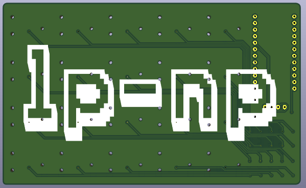

lp-np
=====

The Low Profile - Numpad (lp-np) is my first attempt at creating my own PCB from scratch.
This was done with the long-lasting wish to create some hardware.
A keyboard (numpad in this case) is a first project with less complexity on the used parts and hardware.
In the past I gathered some experience in ordering and soldering a [Corne](https://github.com/foostan/crkbd) keyboard
and for creating this project I used the KiCad files as a template.
This helped me to get the right schematic and after some trial and error a layout that looks right.

**2025-11-09**: Assembly done

 

**2025-10-28**: PCB has arrived

 

**2025-10-15**: PCB is done next order all required parts and 3d-printing.

## Parts and PCB footprint

The PCB design would not been possible without the aid of the [Corne](https://github.com/foostan/crkbd) keyboard project
where the base footprint for the used ProMicro and display header originate from.
For the switches I got my hands on the Cherry MX ULP (Ultra Low Profile) Switches which
are pretty well documented in [the repo of pashutk](https://github.com/pashutk/Cherry_MX_ULP/tree/main).
Here example projects, footprints, datasheets and sourcing information can be found.

## Caps

For the caps, I resorted to 3D printing my own.
A base model can be found in the [zmk-config-mikefive repo of mikeholscher](https://github.com/mikeholscher/zmk-config-mikefive/).
This repo uses _Kailh PG1316S_ switches, which have a similar footprint to Cherry switches.
Keycap.step files for 3D printing can be found in the repository.

# Bill of Materials (BOM)

| Reference | Component Description                               | Value      | Amount |
|:----------|:----------------------------------------------------|:-----------|:-------|
| U         | ProMicro (or compatible derivate)                   |            | 1      |
| U-Header  | Generic connector, single row,                      | Conn_01x12 | 2      |
| J         | Generic connector, single row, 01x04                | Conn_01x04 | 1      |
| RSW1      | Momentary Tact Tactile Push Button Switch 2 Pin DIP | 3x6        | 1      |
| OLED      | Mini 0.91 Inch 128x32 OLED                          | Optional   | 1      |
| D         | Diode (SOD-123)                                     | D          | 20     |
| SW        | Cherry MX ULP (Ultra Low Profile) Switches          | SW_Push    | 20     |